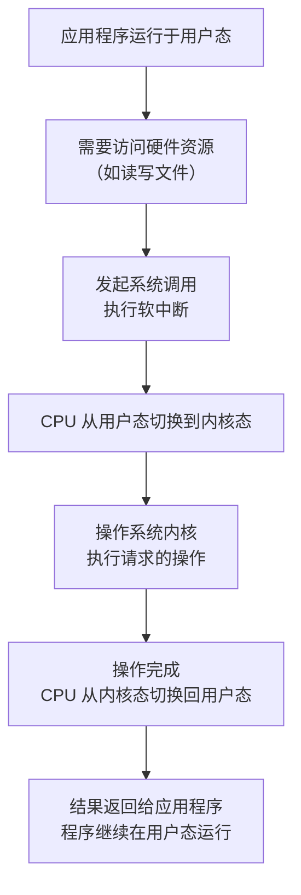

# Go语言100问
####### 语言基础 #######
============================
## 一、逃逸分析
### 1.逃逸分析是什么？
>逃逸分析是分析**指针动态范围**的方法，它决定一个变量是分配在**堆上**还是分配在**栈上**。
>在Go语言里，它是编译器执行静态代码分析后，对内存管理进行的简化和优化。
### 2.逃逸分析有什么作用？
>可以尽量把那些不需要分配到堆上的变量直接分配到栈上，堆上的变量少了，会减轻堆内存分配的开销，同时也会减少垃圾回收（GC）的压力，提高程序的运行速度。
### 3.逃逸分析是怎么完成的？
>1) 基本原则：如果一个函数返回对一个变量的引用，那么这个变量就会发生逃逸。
>2) 编译器根据变量是否被外部引用来决定是否逃逸：
>>1) 如果变量在函数外部**没有引用**，则优先放在栈上。
>>> 这种情况放到堆上的情形：定义了一个很大的数组，需要申请的内存过大，超过了栈的存储能力。
>>2) 如果变量在函数外部**存在引用**（例如被返回、赋值给全局变量、被闭包引用等），则必定放到堆上。
### 4.如何确定是否发生逃逸？
>1 命令行：go build -gcflags '-m -l' main.go
##### 常用 gcflags 参数一览表
| 参数 | 功能说明 | 适用场景举例 |
|:---|:---|:---|
| **-m** | 打印逃逸分析结果，可多次使用 (`-m -m`) 获取更详细信息 | 分析变量内存分配，优化性能 `go build -gcflags="-m" main.go` |
| **-N** | **禁用编译器优化** | 调试时保持代码结构，便于调试器工作 |
| **-l** | **禁用函数内联** (inline) | 调试时保留完整函数调用栈 |
| **-S** | **输出汇编代码** | 分析函数底层实现和性能热点 |
| **-w** | 不生成 DWARF 调试信息 | 减小二进制文件体积 (会使调试困难) |
| **-s** | 关闭符号表 | 减小二进制文件体积 (会使调试困难) |
| **-B** | 禁用边界检查 | 提高性能，但可能带来安全隐患 |
| **-e** | 不限制错误信息的数量 | 需要显示所有编译错误时 |
| **-c int** | 设置编译过程的并发数，默认为 1 | 调整编译并发度 `go build -gcflags="-c=4"` |
>2 反汇编命令：go tool compile -S main.go
> 参数用法和上面的一致
### 5.Go与C/C++中的堆和栈是同一个概念吗？
> 核心概念是相同的：在程序启动时，操作系统会自动维护一个所启动程序消耗内存的地址空间，并自动将这个空间从逻辑上划分为**堆内存空间**和**栈内存空间**。

无论是在 Go 还是 C/C++ 中：

栈（Stack）：都用于存储局部变量、函数参数、返回地址等。每个 Goroutine（Go）或线程（C/C++）都有自己的栈内存。它的分配和释放由编译器通过指令指针的移动自动管理，速度极快。

堆（Heap）：都是一个供程序在运行时动态申请内存的区域。从堆上分配的内存生命周期不确定，需要一套机制来管理（分配和回收），否则就会造成内存泄漏。

> 差异：上述所说的**栈内存空间**在Go语言中运行时就全部消耗了，用于维护运行时各个组件之间的协调，例如**调度器**、**垃圾回收**、**系统调用**等。
> 对于用户态的Go代码而言，它们所消耗的"堆和栈"，其实只是Go运行时通过管理向操作系统申请的**堆内存**，构造逻辑上的"堆和栈"，本质上都是从操作系统申请而来的堆内存。

##### 深入解析关键差异
###### 1）. **分配决策机制：核心区别**，这是 Go 和 C/C++ 最根本的不同。

C/C++：开发者显式控制
在 C/C++ 中，变量分配在堆还是栈上，主要由开发者通过关键字决定。

> int var; 或 int array[10]; → 在栈上分配。函数返回时自动释放。
>
> malloc(), calloc(), new → 在堆上分配。必须由开发者手动调用 free() 或 delete 来释放，否则会造成内存泄漏。

Go：编译器通过“逃逸分析”决定
Go 语言模糊了堆和栈的界限对开发者的可见性。你使用 & 取地址或 new 关键字并不一定意味着在堆上分配。
Go 编译器会进行逃逸分析（Escape Analysis）：分析变量的作用域是否会逃逸出函数之外。

> 如果变量没有逃逸出函数，编译器会优先将其分配在栈上（即使用了 new），因为栈分配效率极高。
>
> 如果变量逃逸到了函数外部（例如被返回、赋值给全局变量、被闭包引用等），编译器会自动将其分配在堆上。

###### 2）. **内存管理（释放）机制**

C/C++：手动管理（Manual Management）
堆内存必须手动释放。这是 C/C++ 程序中最常见的错误来源之一：
>内存泄漏（Memory Leak）：忘了 free。
>
>悬垂指针（Dangling Pointer）：提前 free 了还在使用的内存。
>
> 重复释放（Double Free）：对同一块内存 free 两次。

Go：自动垃圾回收（Garbage Collection - GC）
Go 运行时内置了一个并发的垃圾回收器。它会自动追踪哪些堆内存不再被任何变量引用，然后将其回收。开发者完全不需要关心内存的释放问题。
>优点：极大提升了开发效率和程序安全性，避免了内存管理错误。
>
>代价：GC 过程会消耗一定的 CPU 资源，并且在回收时可能会产生极短的停顿（Go 的 GC 经过多年优化，现在的停顿时间已经非常短）。

###### 3）. **栈的实现**
C/C++：固定大小的栈
>传统 C/C++ 线程的栈大小是固定的（例如 1MB/2MB/8MB），在编译时或线程创建时确定。如果栈空间不足（比如过深的递归或非常大的局部变量），会导致栈溢出（Stack Overflow），程序崩溃。

Go：动态可变栈
每个 Goroutine 在启动时只有一个很小的栈（最初约 2KB）。当栈空间不足时，Go 运行时会自动分配一块更大的新栈，并将旧栈的内容拷贝到新栈中。这个过程对开发者是透明的。
>优点：更高效地利用内存，可以轻松创建成千上万的 Goroutine 而不会耗尽内存。
>
>代价：栈扩容时需要拷贝，有微小的性能开销。
>

### 6.Go语言的栈内存进一步说明：
###### 1）初始栈大小与上限
|    栈内存类型    |     大小      |                       说明         |
|:-----------:|:-----------:|:--------------------------------:|
|  **初始栈大小**  |     2KB     | 每个 goroutine 启动时被分配的栈空间大小。 |
| **默认栈大小上限** | 1GB (64位系统) |单个 goroutine 的栈空间所能增长的最大限制，在 64 位系统上默认是 1GB。|

###### 2）栈内存管理
>Go 运行时通过**连续栈（Contiguous stack）** 机制管理 goroutine 的栈内存。当 goroutine 的栈空间不足时，运行时会自动分配一个**大约两倍于旧栈的新栈**，并将旧栈的内容复制到新栈，然后释放旧栈。这个过程对开发者是透明的（不可见）。

>为了高效分配栈内存，Go 运行时维护了**全局栈缓存（runtime.stackpool** 用于小于 32KB 的内存，**runtime.stackLarge** 用于大于 32KB 的栈空间），并且在每个逻辑处理器（P）的本地缓存（mcache）中也包含了栈缓存，以减少锁竞争。

###### 3）如何设置栈大小上限
>通过 runtime/debug 包中的 SetMaxStack 函数来调整单个 goroutine 的栈大小上限。
>
>一般情况无需手动修改栈大小上限，除非确信遇到了深递归等需要更大栈空间的情况，或者为了节省内存希望限制栈大小。
>
>注意：修改此值会影响程序的所有 goroutine，需谨慎操作。

###### 4）防止内存碎片化
>对于用户态Go代码**消耗的栈**，Go语言运行时会为了防止内存碎片化，会在适当的时候对整个栈进行深拷贝，将其整个复制到另一块内存区域（对开发者不可见）
>
> 影响：Go语言的指针的算术运算不再能奏效。因为无法确定运算前后指针所指向的地址的内容是否已经被Go运行时移动。

### 7.用户态、内核态：
###### 1）怎么理解“用户态”和“内核态”？
这其实是操作系统的核心概念。为了安全性和稳定性，现代操作系统设置了两种执行模式：
>1. 内核态 (Kernel Mode)
>* **权力：“上帝模式”**。在此模式下，代码可以无障碍地访问所有硬件资源（CPU、内存、硬盘、网络等），执行任何特权指令。
>* **谁在里面运行**：主要是**操作系统内核**本身。它是操作系统的核心，负责管理最底层的硬件和关键资源。

>2. 用户态 (User Mode)
>* **权力：“普通用户模式”**。在此模式下，代码不能直接访问硬件或执行特权指令。如果应用程序需要做这些操作（比如分配更多内存、读写文件、发送网络包），它必须向内核“申请”。
>* **谁在里面运行**：所有的应用程序，包括你的 Go 程序、浏览器、文本编辑器等。

一个生动的比喻：
>* 内核态就像公司的CEO和核心管理层，他们有权直接调用公司所有资源（资金、人员、设备）。
>* 用户态就像公司的普通员工。员工不能直接调用公司资金或使用特定设备。他们需要向管理层提交申请（系统调用），经批准后，由管理层来执行操作。

两者如何协作？
>* 当用户态的应用程序需要内核的帮助时（比如读取一个文件），它会执行一个 “系统调用” 。这时，CPU 会从用户态切换到内核态，由内核来完成请求，然后再切换回用户态，将结果返回给应用程序。
>
>
>* 这个过程（用户态 -> 系统调用 -> 内核态 -> 返回用户态）是有一定开销的。

